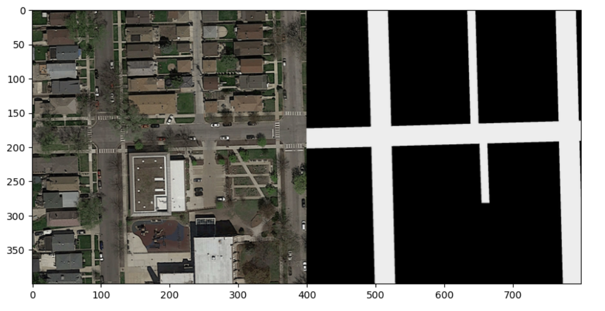

This project was completed as a group project at EPFL in Switzerland during my 5th semester of studies.

#  Road Segment Detection from Satelite Images with use of Machine Learning

This project compares the performance of Machine Learning models for the Road Segmentation task. It's aim is to find the best model to categorize pixels in images as either road or background in order to find an effective way to distinguish road sections in images. 

## Contributors:
- Adam Ben Slama (<adam.benslama@epfl.ch>) 
- Alicja Jonczyk (<alicja.jonczyk@epfl.ch>)

## Files and project architecture 
This is the reposiotry organization and file explanation.

- `/ml-project-2-alicja_adam-1`
    - `/dataset`
        - `/test_set_images`: contains all test images
        - `/training`: contains all train images and corresponding ground truth
            - `/augmented_dataset`: contains the augmented dataset
                - `/groundtruth_augmented`: contains the augmented groundtruth dataset
                - `/images_augmented`: contains the augmented images
            - `/groundtruth`: contains all groundtruth images
            - `/images`: contains all training images
            - `/mask`: contains all the masks created for the testing 

    - `/functions`
        - `data_augmentation_show.py`: implementation of data augumentation used to display the transformations
        - `data_augmentation.py`: implementation of data augumentation
        - `dataset.py`: implmentation of the RoadSegmentationDataset
        - `FCN.py`: implementation of the FCN Model
        - `folder_creation.py`: contains helper function for folder managemant 
        - `mask_to_submission.py`: helper file to create the submission file for AIcrowd
        - `random.py`: implementation of the Random Model
        - `SegNet.py`: implementation of the SegNet model
        - `submission_to_mask.py`: helper function for creating the submission file for AIcrowd
        - `U_net.py`: implementation of U-Net
    
    - `/image_helpers`: folder with helper functions for images
        - `image_help.py`: file with helper functions for images
    
    - `/models`: folder to store the best model
        - `best_model.pth`: file containing the best model
        - `ReadMe.md`: file containing the link to the drive where our best model is stored
   
    - `FCN.ipynb`: jupyter notebook with results of FCN Model
    - `Random.ipynb`: jupyter notebook with results of Random Model
    - `ReadMe`: ReadMe file with explanation of our project 
    - `requirements.txt`: file with all the necessary libraries to run our code
    - `run.py`: script to run the training process and generate predictions
    - `sample_submission.csv`: file with our best submision on AIcrowd
    - `SegNet.ipynb`: jupyter notebook with results of U-Net Model
    - `Unet.ipynb`: jupyter notebook with results of U-Net Model

## Libraries
These are the libraries necessary to install in order to run our project:

- Numpy

`conda install -c conda-forge numpy=1.26.2`\
`pip install numpy==1.26.2`

- Matplotlib

`conda install -c conda-forge matplotlib=3.8.1`\
`pip install -U matplotlib==3.8.1`

- Pytorch

`conda install pytorch::pytorch=2.1.1 torchvision=0.16.1 torchaudio=2.1.1 -c pytorch`\
`pip install torch==2.1.1 torchvision==0.16.1 torchaudio==2.1.1`

- Scikit-learn

`conda install -c conda-forge scikit-lean=1.3.2`\
`pip install scikit-lean==1.3.2`

## Submisson run 
To generate the submission file for the AIcrowd challenge please run the run.py file.
